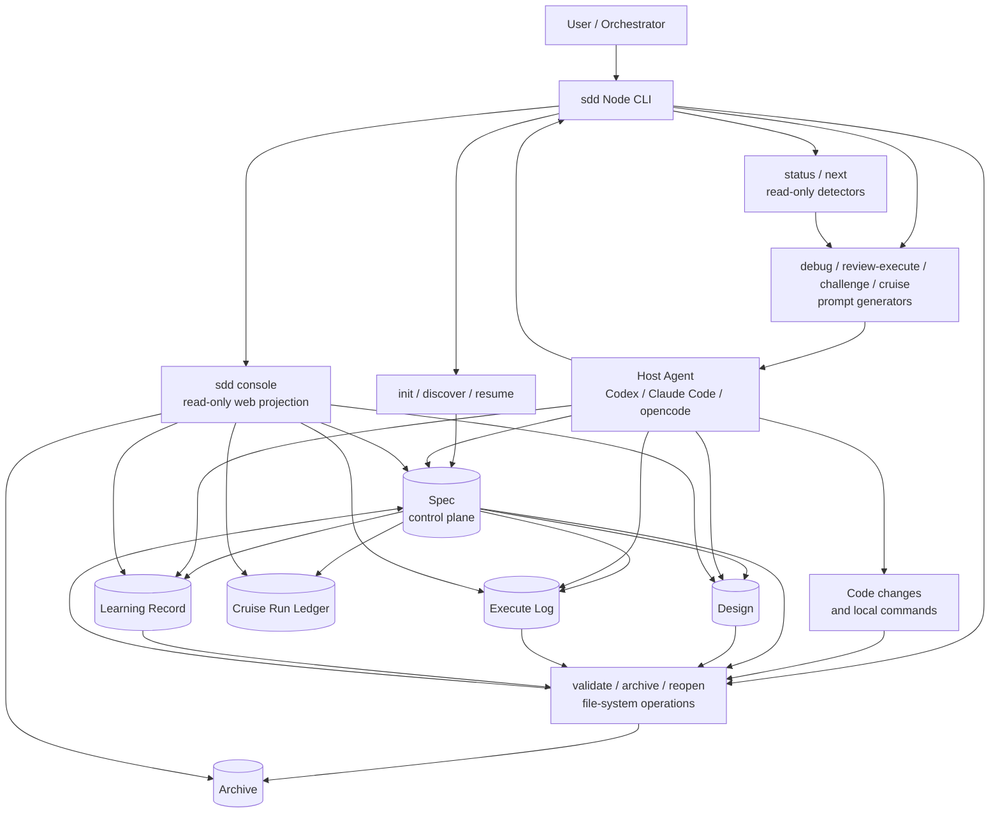

# SDD-RIPER 使用指南

这份指南补充 README，说明流程细节、三种模式、产物边界、subagent 策略和验收标准写法。当前版本的 SDD-RIPER 是 Node CLI 和文件系统产物协议，不是模型执行 runtime；它通过 prompt、门禁和账本引导宿主 agent 或人工推进。

## 设计理念

### SDD 是控制协议层，不是 harness

harness（Claude Code、Codex CLI 等）是承载 agent 运行的运行时外壳，负责工具调用、权限、上下文窗口和模型执行循环。SDD 不做这些，也不该做。SDD 是骑在 harness 之上的**控制协议层**：它定义“做什么、何时停、出问题回退到哪”，以及一条由 Spec / Design / Execute Log / Learning 组成的产物真相链；真正的模型执行和代码修改由宿主 harness 完成。

用“是不是完备 harness”衡量 SDD 是用错了标尺。该问的是：作为 AI 交付的控制协议，它是否覆盖了 意图捕获 → 设计 → 计划 → 执行审计 → 验证门禁 → 复盘沉淀 → 归档复用 的完整链路，并在 advisory / autonomous 两种模式下都成立。

### 四个核心组件的关系

| 组件 | 角色 | 比喻 |
| :--- | :--- | :--- |
| `workflow`（内部状态引擎） | 只读分析 Spec + 门禁，输出 verdict / 回跳目标 / 下一步 / risk flags / 方法论建议 | 大脑读数 |
| `cruise`（自主巡航） | 把状态包装成循环契约：每轮修哪块、何时停、FAIL 回退到哪；自己不跑 | 循环契约书 |
| 宿主原生 loop（Claude Dynamic Workflows / Codex / opencode） | 真正一轮一轮执行 | 借来的发动机 |
| `challenge`（对抗审核） | 独立只读 reviewer，给出真正裁决 | 每轮裁判 |

关键解耦：`workflow` 只发“应该用 ADR / 回退到 Design”这类**信号/指针**，不持有方法论实体和执行循环；方法论实体在 `SKILL.md` / `protocols/` / `vendored/`，执行循环借宿主，challenge 的裁决独立于实现 agent（裁判不能是运动员）。这就是“SDD 是控制协议、不是执行器”的落地方式。

## 一、产物边界

当前版本采用 **Spec 控制面 + 独立 Design + 独立 Execute Log + 条件 Learning Record**。

| 产物 | 存放位置 | 职责 |
| :--- | :--- | :--- |
| Spec | `<docs-root>/specs/` | 需求、Research、Innovate、Acceptance Criteria、Plan、审批、Review verdict，以及 `design-file` / `execute-log-file` / `learning-file` 引用。 |
| Design | `<docs-root>/design/` | standard 的 `Technical Design` 或 lite 的 `Design Note`。micro 不创建独立 Design。 |
| Execute Log | `<docs-root>/logs/` | 执行步骤、偏差、验证结果，append-only。 |
| Learning Record | `<docs-root>/learnings/` | 偏差、BUGFIX、concern、reopen 暴露出的可复用决策规则。 |
| Cruise Run | `<docs-root>/runs/` | 巡航 iteration、engine、verdict、回跳目标和停止原因，属于可观测性账本，不替代核心产物。 |

Spec 是控制面，不再承载完整技术设计、执行日志和经验库。这样 Review 和 Archive 可以分别审查规范、设计、执行事实和可复用经验。

阶段产物的模板结构保持英文，包括章节标题、人工字段标签、frontmatter 键、`design-file` / `execute-log-file` / `learning-file` 引用键、CLI 命令名、状态枚举、验证类型枚举和 `AC-###` 编号。实际填充的需求分析、方案取舍、设计说明、计划步骤、执行说明、证据和经验规则使用中文。

## 二、流程架构图



这张图的关键边界是：

- `sdd next` / `status` 只读分析文件系统产物，不修改代码或文档。
- `sdd debug` / `review-execute` / `challenge` / `cruise` 生成 prompt，不直接调用模型 API。
- `sdd cruise --record-run` 只把当前巡航状态追加到 `<docs-root>/runs/*.cruise.jsonl`，不会自动执行下一轮。
- `sdd console` 是只读 projection，可打开和预览产物，但不是新的 source of truth。
- `validate` / `archive` 是真正的机器门禁和文件归档操作。

## 三、RIPER 流程

```text
Research -> Innovate -> Design/Acceptance -> Plan -> Execute -> Review -> Learning Check -> Archive
```

巡航能力不会取消 RIPER 产物合同。`sdd next` 用于判断下一步和回跳目标，`sdd challenge` 用于生成独立对抗评审 prompt，`sdd cruise` 用于生成有预算的巡航控制 prompt。

loop 的执行优先复用宿主 agent 能力：Claude Code 可使用 Dynamic Workflows，Codex / opencode 如果当前运行面支持原生自主循环，也应直接复用。SDD 不自建模型执行 runtime；它只提供状态机、门禁、回跳映射和产物真相链。宿主不支持原生 loop 时，退回 `prompt` 或 `local-loop` prompt-loop 补偿模式；SDD 只记录 iteration 快照，不执行模型循环。

`CRUISE_POLICY="off"` 会禁用巡航 prompt 和 run ledger；`assisted` 要求人在每轮修复之间确认；`autonomous` 才允许宿主原生 loop。

`sdd cruise --engine claude-code --emit-claude-prompt` 会输出包含 `ultracode:` 和 `/effort ultracode` 提示的 Claude Code workflow 启动 prompt；真正的 workflow script 由 Claude Code 自己生成和执行。`sdd cruise --record-run --iteration N` 会追加 `<docs-root>/runs/<spec>.cruise.jsonl`，用于 Console 和人工审计查看巡航状态。

### Research

目标是把“原始要求”变成可执行的 Confirmed Requirement。应产出：

- Requirement Review：歧义、隐含假设、风险、外部依赖。
- Findings：从代码、文档、历史 Spec 得到的事实。架构概览可按需运行 `sdd codemap <dir>`。
- Open Questions：必须澄清的问题。**Agent 应主动用 `AskUserQuestion` 交互式提问，而非仅列出问题等用户自行编辑。** 提问时给出具体选项，用户回答后写入 spec 的 Assumptions 或 Confirmed Requirement，并从 Open Questions 中移除。
- Assumptions：暂时接受但需要追踪的假设。
- Confirmed Requirement：校准后的需求边界。

### Innovate

目标是定义方案，而不是写一句“使用现有实现”。standard 至少比较两个方案：

- 方案描述。
- 优点、缺点。
- 技术风险。
- 与需求的匹配度。
- 被拒绝方案的原因。
- 选中方案。

lite 可以跳过 Innovate，但必须写 `Innovate: Skipped, Reason: ...`。

方案探索与设计澄清可借助 vendored 的 `brainstorming` 方法（见第六节）：一次一问澄清意图、提出 2-3 个方案并给推荐、分段呈现设计并逐段确认，且“无设计批准不进实现”。注意 SDD 适配——产物落到 Spec 的 `Innovate Options` 和外部 `design-file`，不走 brainstorming 默认的 `docs/superpowers/specs/` 路径，也不自动转入 writing-plans（交给 SDD 自己的 Plan 门禁）。

### Design / Acceptance

Design 在 Innovate 之后、Plan 之前完成。

设计方法论按 `mode` + 风险**路由**，不是把所有方法论铺到每个任务。`sdd next` / `sdd cruise` 会输出 `DESIGN_METHOD` 和 `DESIGN_FOCUS_FIELDS` 作为 advisory 建议：micro 无独立设计；lite 用 ADR；standard 用 ADR + arc42 字段结构 + C4 视图；命中 `migration` / `public-api` / `security` / `billing` / `irreversible` 风险时点亮对应的 Design 重点字段；领域复杂时建议考虑 DDD。建议是 advisory，最终由 orchestrator 判断（机制见第六节）。

standard 写独立 `Technical Design`。它不是方案说明，而是技术设计合同。归档门禁强制检查核心字段：

- Selected Option / ADR。
- Requirement Traceability。
- Impact Scope。
- Architecture View，必要时用 C4。
- Data Model / Schema。
- Interface Contract。
- Compatibility / Rollback。
- Test Strategy。

以下字段按需填写，但涉及对应风险时不应省略：

- Context / Boundary。
- Domain Model。
- Data Migration / Backfill。
- API Protocol。
- State / Concurrency。
- Failure Modes。
- Security / Permission。
- Observability。
- Performance / Capacity。
- Risks / Trade-offs。

lite 写独立 `Design Note`，至少覆盖：

- Approach。
- Impact Scope。
- Interface / Data Impact。
- Compatibility。
- Risks。
- Test Strategy。

micro 不写独立 Design，但 Plan 必须有：

- Scope。
- Touched Files。
- Change。
- Impact Scope。
- Data Impact。
- Interface Impact。
- Acceptance。
- Verification。
- Blast Radius。

Acceptance Criteria 留在 Spec。推荐使用 AC 编号和 BDD 场景：

```gherkin
### AC-001: 用户可以用正确凭证登录
Requirement: login
Type: functional
Verification: e2e
Automated: yes
Test: tests/auth/login.test.ts

Scenario: 有效登录
  Given 一个已注册用户
  When 用户提交有效邮箱和密码
  Then 系统创建已认证会话
```

好的验收标准必须可观察、可验证、可追踪到需求，不应写成“代码实现完成”。`Verification:` 是归档门禁字段，取值为 `unit` / `integration` / `e2e` / `manual`。E2E AC 必须提供 `Test:` 或 `Manual Evidence:`；manual AC 必须提供 `Manual Evidence:`。

### Plan

Plan 是执行契约，不是技术设计的替代品。Plan 必须从 Design 和 Acceptance Criteria 推导出来，每步包含：

- 文件路径。
- 具体改动。
- 对应 AC 或验收条件。
- 验证方式。

进入 Execute 前必须填写：

```text
Plan Approved By: <user>
Approved At: <timestamp>
Gate Policy: manual | auto | advisory
Gate Evidence: <auto-gate 时必填>
```

默认 `GATE_POLICY="auto"`。三种策略：

- **manual**：必须由人工填写 `Plan Approved By: <user>` 和 `Approved At:`，AI 不能自行批准。
- **auto**：AI 可填写 `Plan Approved By: auto-gate`，但必须同时提供 `Approved At:` 和 `Gate Evidence:`（验证结果、测试通过等事实依据）。auto gate 不是无门禁——缺任何一项都会被 validate 拦截。
- **advisory**：与 auto 行为一致，但在 Review 阶段会额外提示人工确认。

同时可在 `.sdd-config` 中配置：`GATE_POLICY="manual|auto|advisory"`。

**Plan 未批准时的行为**：如果 Plan 因 Open Questions 未解决而无法批准，Agent 应主动用 `AskUserQuestion` 交互式澄清每个问题，而非仅提示"存在问题"。澄清后更新 spec，再走门禁。

### Execute

Execute 只做 Plan 已批准的内容。每个步骤完成后写入 `execute-log-file` 指向的 Execute Log：

```text
Step: 1
Status: DONE | BLOCKED | DEVIATED_MINOR | DEVIATED_MAJOR
Files: ...
Result: ...
Verification: ...
Deviation: ...
Timestamp: ...
```

重大偏差必须暂停并回到 Plan / Design，而不是事后改写 Spec 合理化实现。

### Review

Review 是四轴审查：

| 轴 | 检查内容 |
| :--- | :--- |
| Axis 0 | Intake 是否仍然对齐原始目标。 |
| Axis 1 | Design / Acceptance / Plan 是否覆盖完整。 |
| Axis 2 | Code Diff 是否越界。 |
| Axis 3 | Execute Log 是否忠实反映真实改动。 |

Axis 2 是 primary axis。Axis 0、1、3 是确认轴，任何一轴失败都应阻止归档或触发修正。

### Challenge / Cruise

对抗评审建议由独立 challenge agent 执行。standard/lite 默认要求独立角色；micro 可以内联执行，但必须按独立评审者输出 verdict。

```text
sdd next <project-dir>
sdd challenge <project-dir>
sdd cruise <project-dir> [--engine auto|prompt|local-loop|claude-code|codex|opencode] [--emit-claude-prompt] [--record-run] [--iteration N]
```

Challenge verdict 枚举：

- `PASS`
- `PASS_WITH_CONCERNS`
- `FAIL_SPEC`
- `FAIL_DESIGN`
- `FAIL_ACCEPTANCE`
- `FAIL_PLAN`
- `FAIL_CODE`
- `FAIL_LOG`
- `FAIL_LEARNING`

任何 `FAIL_*` 都会阻止 archive，并作为 `sdd cruise` 的回跳信号：需求问题回 Research，设计问题回 Design，验收问题回 Acceptance，计划问题回 Plan，代码问题回 Execute / Debug，日志问题回 Execute Log，经验沉淀问题回 Learning Check。巡航超过 `CRUISE_MAX_ITERATIONS` 或遇到安全、权限、计费、数据迁移、公共 API、不可逆变更时必须停止并要求人工介入。

`--engine auto` 是默认值。它的策略是：先复用宿主原生 loop；没有原生 loop 时，要求宿主 agent 或人工把同一套 `sdd next -> repair -> validate -> review/challenge -> backtrack` 作为普通 prompt loop 执行。无论使用哪个 engine，`Spec / Design / Plan / Execute Log / Learning` 都不能被宿主 workflow 文件替代。

### Learning Check

Learning Check 在 Review 之后、Archive 之前执行。它不是复盘作文，而是把本次任务暴露出的可复用判断沉淀成规则。

以下情况必须创建 Learning Record：

- Execute Log 出现 `BUGFIX`、`BUGFIX_ESCALATED`、`DEVIATED_MINOR` 或 `DEVIATED_MAJOR`。
- Review verdict 是 `PASS_WITH_CONCERNS`。
- 任务来自 archived spec 的 reopen。
- Execute 或 Review 发现验收标准本身不充分。
- 同类失败模式重复出现。

创建命令：

```text
sdd new-learning <project-dir> [spec-name]
```

生成的 `learning-file` 必须填充 `Source Spec`、`Trigger`、`Observed Problem`、`Root Cause`、`Decision Rule`、`Applies When`、`Recommended Action` 和 `Evidence`。字段值和规则正文使用中文。`validate --archive-ready` 会在需要 Learning Record 时检查这些字段。

### Archive / Reopen

归档前运行：

```text
sdd validate <project-dir> --archive-ready
```

`archive` 会再次执行同一套校验，通过后把 Spec、Design、Execute Log，以及已绑定的 Learning Record 一起移动到 `<docs-root>/archive/`，并更新归档 Spec 内的引用。

修复已归档任务时使用：

```text
sdd reopen <project-dir> <task-slug> --defect "缺陷描述"
```

不要重新 `discover`，否则会切断历史上下文。

## 四、三种模式

| 门禁 / 产物 | standard | lite | micro |
| :--- | :---: | :---: | :---: |
| Research | 完整 | 保留 | 跳过 |
| Innovate | 至少两个方案 | 可跳过但写 Reason | 跳过 |
| Design | 独立 Technical Design | 独立 Design Note | 不单独创建 |
| Acceptance | AC-###，推荐 BDD | 轻量 AC | Plan 中的 Acceptance |
| Plan Approval | 必须 | 必须 | 必须 |
| Execute Log | 独立文件，必填 | 独立文件，必填 | 独立文件，必填 |
| Learning | 条件必填 | 条件必填 | 条件必填 |
| Review | 四轴 | 四轴 | 默认 Axis 2 |
| Subagent | 推荐 | 可选 | 默认不用 |

模式选择建议：

- 新功能、重构、跨模块、外部契约、安全/权限/计费/数据迁移：用 standard。
- 中小改动、需求明确、影响面有限：用 lite。
- 单文件、低风险、可逆、无公共接口影响：用 micro。

当任务涉及安全、权限、计费、数据迁移、公共接口、跨模块副作用或不可逆变更，即使只改一个文件，也应升级到 lite 或 standard。

## 五、Subagent 策略

不采用“关键环节全部 subagent owner 化”。

推荐策略是：

- subagent 做 **evidence owner**：读取大量代码、历史 Spec、依赖文档，返回压缩证据。
- subagent 做 **work-package owner**：在大执行任务中处理局部实现包。
- subagent 做 **review axis owner**：分别检查 Review 的某个轴。
- orchestrator 做 **decision owner**：需求边界、方案选择、Plan gate、最终 verdict、归档一致性都由主上下文负责。

不可交给 subagent 直接决定的事项：

- Final Review verdict。
- Plan Approval。
- Completion Verification。
- 规范性产物的最终改写。

micro 默认不派发 subagent。lite 只在代码阅读量大或上下文污染风险高时派发。standard 推荐在 Research、复杂 Execute、Review 轴审查中使用。

## 六、两层方法论与方法论路由

SDD 自身只定义流程契约，具体“怎么把事做好”交给两层可加载的方法论。

### 执行质量层（vendored superpowers）

`vendored/superpowers/` 物理内置了 7 个来自 [obra/superpowers](https://github.com/obra/superpowers) 的方法论 skill，绑定到 RIPER 各阶段动作。触点映射见仓库根的 `INTEGRATIONS.md`；加载顺序为：宿主全局 skill → vendored 副本 → `SKILL.md` 内联摘要。

| Skill | 接入阶段 |
| :--- | :--- |
| `brainstorming` | Innovate（方案探索 / 设计澄清） |
| `writing-plans` | Plan（步骤粒度） |
| `test-driven-development` | Execute（TDD） |
| `systematic-debugging` | Execute（debug / BUGFIX，先定根因） |
| `verification-before-completion` | Execute（完成验证门禁） |
| `subagent-driven-development` | Subagent 派发 |
| `finishing-a-development-branch` | Archive（收尾分支） |

按 scope 政策只 vendor 方法论 markdown，不带 `scripts/` / `hooks/`（仅 `brainstorming` 的浏览器可视化伴侣因此降级为纯文本，需要时用宿主全局 superpowers）。维护流程见 `vendored/superpowers/SYNC.md`。

### 设计方法层

设计 / 架构方法论按复杂度进入 Design 或 Acceptance，不是固定模板：

| 参考 | 用在哪里 |
| :--- | :--- |
| DDD | 业务规则、领域模型、限界上下文、统一语言。 |
| C4 Model | 系统、容器、组件边界和依赖关系。 |
| ADR | 重要技术取舍和长期影响决策；写法见 `protocols/adr.md`。 |
| arc42 | standard 模式下完整技术设计结构。 |
| TOGAF | 多系统、多团队、企业级视角，按需借鉴业务/数据/应用/技术维度。 |
| 凤凰架构 | 分布式、可靠性、演进式架构、故障模式和权衡。 |
| BDD / Gherkin | 用户行为、CLI 行为、错误处理、状态变化验收。 |
| Learning Record | 执行后沉淀可复用判断规则，反哺后续 Research / Design / Plan / Review。 |

与执行质量层不同，设计方法层目前多为文字指引；只有 ADR 做成了本地可加载资源 `protocols/adr.md`（Nygard 极简格式，填进 Design 的 `Selected Option / ADR` 字段）。DDD / C4 / arc42 维持按需指引，不内置——符合 SDD“抽象、不绑定技术栈”的定位。

### 方法论路由

不要把所有方法论铺到每个任务。SDD 复用已有的 `mode` + `riskFlags` 信号路由设计方法：`sdd next` / `sdd cruise` / `sdd challenge` 输出 `DESIGN_METHOD` / `DESIGN_FOCUS_FIELDS` 作为 advisory 建议（micro 无 / lite→ADR / standard→ADR + arc42 + C4 / 各 risk 点亮对应 Design 字段 / 复杂领域提示 DDD）。路由是建议性的，信号确定、可被 cruise 和 Console 消费，最终由 orchestrator 拍板。

## 七、CLI 命令

| 命令 | 作用 |
| :--- | :--- |
| `init` | 初始化目录、配置和 AI 指令。 |
| `discover` | 创建 Spec、Design、Execute Log。 |
| `new-learning` | 创建并绑定 Learning Record。 |
| `resume` | 输出当前任务和阶段提示。 |
| `status` | 检查目录结构、Spec、Design、Execute Log 健康度。 |
| `next` | 输出当前 workflow 状态、下一步和回跳目标。 |
| `challenge` | 生成独立对抗评审 Prompt。 |
| `cruise` | 生成巡航控制 Prompt；支持 `--engine`、`--emit-claude-prompt`、`--record-run` 和 `--iteration`，但不直接调用模型或执行循环。 |
| `console` | 启动本地只读 Web Console，查看 Spec 阶段、状态、产物健康度和归档门禁。 |
| `validate` | 机器校验归档门禁。 |
| `review-execute` | 生成四轴 Review Prompt。 |
| `archive` | 归档 Spec 及引用产物。 |
| `reopen` | 基于归档任务创建修复 Spec 和新 Execute Log。 |
| `debug` | 生成根因分析 Prompt。 |
| `codemap` | 按需扫描源码并输出架构视图（不持久化，永不过时）。 |
| `build-context-bundle` | 把外部材料压缩成上下文包。 |
| `install-skill` | 把当前包内的完整 Skill（含 `templates` / `protocols` / `vendored`）注册到 agent 环境（`--target codex\|cc-switch\|claude\|opencode\|all [--clean]`）。 |

安装后使用 `sdd` 命令执行所有操作。`next` / `cruise` / `challenge` 的输出已包含 `DESIGN_METHOD` / `DESIGN_FOCUS_FIELDS` 方法论路由建议（见第三、六节）。

## 八、Web Console

`sdd console [project-dir]` 会启动一个本地只读控制台，用于查看每个 Spec 的阶段、状态、Design / Execute Log / Learning 引用健康度和 `validate --archive-ready` 门禁问题。`project-dir` 可选；不传时在页面里输入或加载项目目录。

Web Console 是文件系统产物的 projection，不是新的 source of truth：

- 数据来源仍然是 `<docs-root>/specs/`、`<docs-root>/design/`、`<docs-root>/logs/`、`<docs-root>/learnings/`、`<docs-root>/runs/`、`<docs-root>/archive/`。
- 项目看板和 Spec 列表读取后台内存索引快照；首次加载或刷新时可能短暂显示 indexing，再自动更新。
- 阶段由最早未满足门禁推导：Research、Innovate、Design、Acceptance、Plan、Execute、Review、Learning、Ready、Archived。
- 详情页展示 gate policy、cruise policy、challenge verdict 和 backtrack target。
- 详情页展示最新 cruise run 的 iteration、engine 和 stop reason。
- 完整归档校验只在详情页和 Validate 操作中按需执行，避免看板和列表加载被全量校验阻塞。
- 当前版本只读展示和校验，不直接编辑 Spec、Design、Execute Log 或 Learning；Edit 按钮只调用本机默认程序打开文件。
- 后续如加入 archive / reopen / discover 操作，也应调用现有命令，而不是在 Web 层直接改文件。

## 九、FAQ

### Plan 能替代技术设计吗？

不能。Design 解释为什么这样做、有哪些边界和取舍；Plan 只说明怎么按步骤执行。standard/lite 缺少 Design 时，`validate --archive-ready` 会阻止归档。

### Execute Log 为什么独立？

执行日志是事实记录，和 Spec 的规范性内容性质不同。独立后 Review 可以检查“计划、实现、日志”三者是否一致，Archive 也能保留完整审计链。

### Spec 还是单一真相源吗？

Spec 是控制面真相源。完整任务真相由 Spec 引用的 Design、Execute Log、Learning 等共同构成。Review 和 Archive 必须沿引用读取，而不是只读 Spec 文件本身。

### 什么时候用 CodeMap？

CodeMap 是按需计算视图（`sdd codemap <dir>`），不持久化、永不过时。在 Research 阶段需要架构概览时运行一次即可。架构事实变更应记录到 Learning Record。
