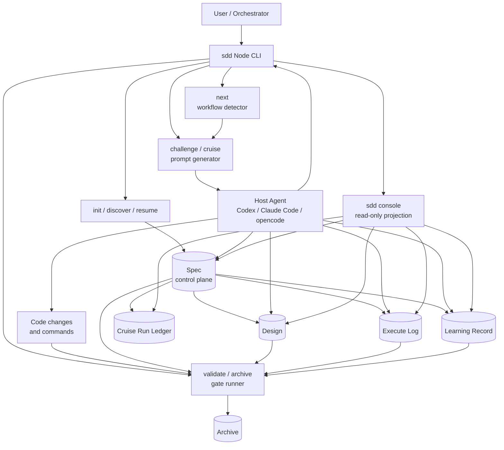

# SDD-RIPER

SDD-RIPER 是一套把 AI 协作开发落到文件系统的工作流。它用 **Spec** 管任务目标和门禁，用 **Design** 管技术设计，用 **Execute Log** 管执行事实，用 **Learning Record** 管可复用经验，用 **CodeMap / ProjectMap** 管架构认知。

它不是模型执行器，也不是通用 agent 平台。当前实现是一套 **Node CLI + 文件系统产物 + 本地只读 Console + Prompt/账本适配层**：CLI 负责创建、校验、归档和生成提示；真正的代码修改、命令执行、动态循环由人或宿主 agent 完成。

核心目标不是多写文档，而是让每个任务都能被追踪、审查和归档：

- 需求不会在长对话里漂移。
- 方案选择有证据和取舍。
- Plan 不能替代技术设计。
- Execute 的真实行为可以被 Review 审计。
- 偏差、返工和 concern 会沉淀为后续可复用的判断规则。
- 归档后可以 reopen，而不是重新 discover 丢失上下文。

## 安装

统一从 GitHub 安装 CLI：

```text
npm install -g git+https://github.com/arsterliu/sdd-riper.git
```

需要 Node.js 18+。安装后检查：

```text
sdd --version
where sdd
```

使用 `git+https` 是为了避免某些 Git 配置把 GitHub HTTPS 地址重写成 SSH，导致没有 SSH key 的环境安装失败。

## 注册 Skill

CLI 和 Skill 是两层：

```text
npm global 目录      -> sdd 命令
Codex/Claude skills -> SKILL.md、templates、protocols、src 等配套文件
```

安装 CLI 后，用当前已安装的 `sdd` 命令把完整 Skill 内容注册到 agent 环境：

```text
sdd install-skill --target codex
```

可选目标：

```text
sdd install-skill --target codex
sdd install-skill --target cc-switch
sdd install-skill --target claude
sdd install-skill --target opencode
sdd install-skill --target all
```

如果是升级或大版本变更，建议清理旧 Skill 目录，避免已删除文件残留：

```text
sdd install-skill --target codex --clean
```

更新后重启 Codex / Claude / OpenCode 会话，以及正在运行的 `sdd console`。

## 更新

日常更新：

```text
npm install -g git+https://github.com/arsterliu/sdd-riper.git
sdd install-skill --target codex --clean
```

多 agent 环境：

```text
npm install -g git+https://github.com/arsterliu/sdd-riper.git
sdd install-skill --target all --clean
```

通常不需要先 `npm uninstall -g sdd-riper`。只有在 `where sdd` 指向旧路径、命令 shim 异常、安装来源变化或更新后仍是旧行为时，才做干净重装：

```text
npm uninstall -g sdd-riper
npm install -g git+https://github.com/arsterliu/sdd-riper.git
sdd install-skill --target codex --clean
```

## 30 秒上手

Skill 触发：

```text
/sdd
```

CLI：

```text
sdd init my-project --mode standard
sdd discover my-project --task-name my-task --version v1.0 --requirement "我要做什么"
sdd resume my-project
```

`discover` 会创建一组任务产物：

- `mydocs/specs/v1.0-my-task.md`
- `mydocs/design/v1.0-my-task.design.md`，micro 模式不创建
- `mydocs/logs/v1.0-my-task.execute.md`

Spec 的 frontmatter 会写入 `design-file`、`execute-log-file` 和 `learning-file`，后续命令都从这些引用读取独立产物。

阶段产物的模板结构保持英文，包括 Spec 阶段标题、Design 字段、Execute Log 字段、Learning Record 字段、frontmatter 键、文件引用键、命令名、状态枚举、验证枚举和 `AC-###` 编号。实际填充的需求分析、方案取舍、设计说明、计划步骤、执行说明、证据和经验规则使用中文。

## 核心产物

| 产物 | 责任 |
| :--- | :--- |
| **Spec** | 控制面。保存 Intake、Research、Innovate、Acceptance Criteria、Plan、审批、Review verdict，并引用 Design / Execute Log / Learning。 |
| **Design** | 技术设计产物。standard 写 `Technical Design`，lite 写 `Design Note`，micro 不单独写设计。 |
| **Execute Log** | 执行事实产物。每个 Plan step 的结果、偏差、验证结果都追加到这里。 |
| **Learning Record** | 经验沉淀产物。把偏差、BUGFIX、concern、reopen 暴露出的规律写成可复用决策规则。 |
| **CodeMap** | 模块级架构地图，记录入口、边界、依赖、风险。 |
| **ProjectMap** | 多仓或多团队协作地图，记录系统边界、接口契约和职责。 |
| **Cruise Run** | 巡航可观测账本。记录 `sdd cruise --record-run` 时的 iteration、engine、next action、verdict 和停止原因，不替代 Spec / Design / Execute Log。 |

## 流程

```text
Research -> Innovate -> Design/Acceptance -> Plan -> Execute -> Review -> Learning Check -> Archive
```

## 流程架构图



- **Research**：澄清需求、约束、事实和不确定性，形成 Confirmed Requirement。
- **Innovate**：至少比较两个方案；lite 可跳过，但必须写明 Reason。
- **Design/Acceptance**：standard/lite 在独立 Design 文件写设计，验收标准仍留在 Spec；micro 把 `Acceptance` / `Verification` 写入 Plan。
- **Plan**：从 Design 和 Acceptance Criteria 拆成原子步骤，必须满足配置门禁。
- **Execute**：严格按 Plan 执行，偏差写入独立 Execute Log。
- **Review**：四轴审查 Intake、Design/Acceptance/Plan、Code Diff、Execute Log。
- **Challenge**：独立对抗评审，主动寻找目标偏离、设计遗漏、验收不可验证和实现越界。
- **Cruise**：在配置策略内生成巡航控制 prompt，引导宿主 agent 按 next/challenge/validate 结果回跳；`sdd cruise` 本身不执行模型循环，也不直接修复代码。
- **Learning Check**：当执行偏差、BUGFIX、PASS_WITH_CONCERNS 或 reopen 暴露可复用经验时，创建 Learning Record。
- **Archive**：`validate --archive-ready` 通过后，Spec、Design、Execute Log，以及已绑定的 Learning Record 一起归档。

Acceptance Criteria 使用 `AC-###` 编号，并必须声明 `Verification: unit | integration | e2e | manual`。BDD / Gherkin 的场景描述用中文表达可观察行为；E2E AC 必须提供 `Test:` 或 `Manual Evidence:`，manual AC 必须提供 `Manual Evidence:`。

Design 按模式分层约束：

- `standard` 的 `Technical Design` 是技术设计合同，归档门禁强制检查 `Requirement Traceability`、`Impact Scope`、`Architecture View`、`Data Model / Schema`、`Interface Contract`、`Compatibility / Rollback` 和 `Test Strategy` 等核心字段。
- `lite` 的 `Design Note` 保持轻量，但必须说明 `Impact Scope` 和 `Interface / Data Impact`。
- `micro` 不创建独立 Design，但 Plan 必须包含 `Impact Scope`、`Data Impact`、`Interface Impact`、`Acceptance` 和 `Verification`。

Gate / Cruise 默认策略：

- 新项目默认 `GATE_POLICY="auto"`、`CRUISE_POLICY="autonomous"`、`CRUISE_MAX_ITERATIONS="5"`。
- `auto` 不是无门禁；`Plan Approved By: auto-gate` 必须同时写明 `Gate Evidence:`。
- `sdd challenge` 的 `FAIL_*` verdict 会阻止归档，并由 `sdd cruise` 映射回对应阶段修复。
- `sdd cruise` 默认使用 `--engine auto`：在 `CRUISE_POLICY="autonomous"` 时优先复用宿主 agent 的原生 loop，例如 Claude Code Dynamic Workflows、Codex native loop、opencode native loop；不可用时退回 prompt loop。
- `CRUISE_POLICY="off"` 会禁用巡航 prompt 和 run ledger；`assisted` 要求人在每轮修复之间确认；`autonomous` 才允许宿主原生 loop。
- `sdd cruise --engine claude-code --emit-claude-prompt` 会输出包含 `ultracode:` 和 `/effort ultracode` 提示的 Claude Code workflow 启动 prompt；真正的 workflow script 由 Claude Code 自己生成和执行。
- `sdd cruise --record-run` 会追加 `<docs-root>/runs/<spec>.cruise.jsonl`，记录 iteration、engine、next action、challenge verdict 和停止原因。
- SDD 不持有模型执行循环；`Spec / Design / Plan / Execute Log / Learning` 仍是真相源。

## 三种模式

| 模式 | 适用场景 | Design | Execute Log | Subagent |
| :--- | :--- | :--- | :--- | :--- |
| `standard` | 新功能、重构、多模块、风险较高任务 | 独立 Technical Design | 独立文件，必填 | 推荐作为 evidence / work-package owner |
| `lite` | 中小改动、上下文明确任务 | 独立 Design Note | 独立文件，必填 | 可选 |
| `micro` | 单文件 bugfix、文案、低风险配置 | 不单独创建，写入 Plan | 独立文件，必填 | 默认不用 |

组合策略：

- **Design / Execute Log 独立产物化是强制策略**。
- **Subagent 不是所有关键环节的 decision owner**；它只做 evidence owner、work-package owner、review axis owner。
- **Orchestrator 永远负责最终目标、门禁、裁决和归档一致性**。

## 常用命令

| 命令 | 作用 |
| :--- | :--- |
| `sdd init <dir>` | 初始化项目结构。 |
| `sdd discover <dir> --task-name <name> --version v1.0 --requirement <text>` | 创建 Spec、Design、Execute Log。 |
| `sdd new-learning <dir> [spec-name]` | 创建并绑定 Learning Record。 |
| `sdd resume <dir>` | 恢复当前任务上下文。 |
| `sdd status <dir>` | 检查结构和流程健康度。 |
| `sdd next <dir>` | 输出当前 workflow 状态、下一步和回跳目标。 |
| `sdd challenge <dir>` | 生成独立对抗评审 prompt。 |
| `sdd cruise <dir> [--engine ...] [--emit-claude-prompt] [--record-run] [--iteration N]` | 生成巡航控制 prompt；可输出 Claude ultracode/workflow 启动提示并写入 run ledger，但不直接调用模型或执行循环。 |
| `sdd console [dir]` | 启动本地 Web Console，可选择项目目录，查看每个 Spec 的阶段、状态、产物健康度和归档门禁。 |
| `sdd install-skill --target codex\|cc-switch\|claude\|opencode\|all [--clean]` | 把当前已安装包携带的完整 Skill 注册到 agent 环境。 |
| `sdd validate <dir> --archive-ready` | 归档前门禁校验。 |
| `sdd review-execute <dir>` | 生成四轴 Review Prompt。 |
| `sdd archive <dir> <spec-name>` | 归档完成任务及引用产物。 |
| `sdd reopen <dir> <slug> --defect <text>` | 基于归档任务创建修复 Spec。 |

## Web Console

```text
sdd console [project-dir]
```

Console 用于观测和诊断，不替代 agent 执行 SDD。它支持：

- 页面里选择项目目录。
- 多项目看板预览。
- 查看 Spec 阶段、状态、产物和归档门禁。
- 查看最新 cruise run 的 iteration、engine 和停止原因。
- 每个产物按 `Spec / Design / Execute Log / Learning` 独立 Preview。
- Preview 新开浏览器 tab，只读显示 Markdown 原文。
- Preview 页提供 `Edit`，用本机默认程序打开对应文件。

## 目录结构

```text
<project>/
├── .sdd-config
├── AGENTS.md / CLAUDE.md
└── mydocs/
    ├── specs/       # 活跃 Spec
    ├── design/      # Technical Design / Design Note
    ├── logs/        # Execute Log
    ├── learnings/   # Learning Record
    ├── runs/        # Cruise run ledger
    ├── codemap/     # 模块地图
    ├── context/     # Context Bundle
    └── archive/     # 已归档 Spec / Design / Execute Log / Learning
```

更多细节见 [GUIDE.md](./GUIDE.md)。
