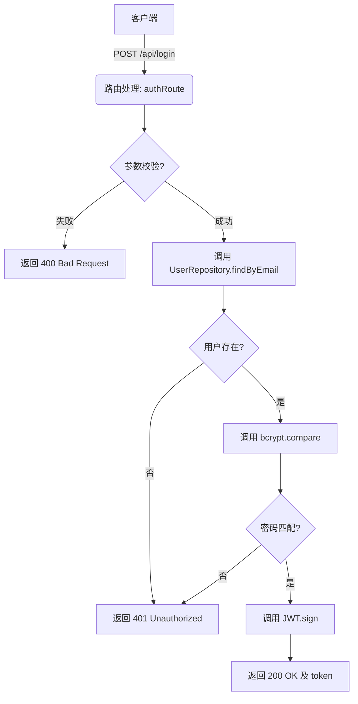

# CodeMap: Backend Auth Service

## 1. 核心调用链路 (Core Flow)

## 2. 关键组件 (Key Components)

- **`src/routes/authRoute`**: 处理 `/api/login` 请求并分配给 Controller。
- **`src/controllers/authController`**: 核心登录逻辑（验证、查询、比对、签发）。
- **`src/repositories/UserRepository`**: 与数据库（例如 `users` 表）交互的仓库层，负责 `findByEmail`。
- **`src/services/jwtService`**: 封装的 JWT 签发与验证工具类。

## 3. 数据流与外部依赖 (Data Flow & External Dependencies)

- **外部依赖:**
  - **用户数据库 (Users DB):** 获取用户记录（`email`, `password_hash`）。
  - **bcrypt 库:** 进行密码哈希安全比较。
  - **jsonwebtoken (JWT) 库:** 签发包含用户 ID 的 token。
- **接口契约:**
  - **输入:** `email` (string), `password` (string)。
  - **输出 (成功):** `token` (string), `expires_in` (integer)。
  - **输出 (失败):** `error` (string: "invalid_credentials")。

## 4. 风险点及注意事项 (Risks & Notes)

- **防止时序攻击:** `bcrypt.compare` 应始终为恒定时间执行。若用户不存在，可返回统一错误，但不应暴露该用户是否存在的信息（如 "该邮箱未注册"）。统一返回 "无效的用户名或密码"（invalid_credentials）。
- **密钥管理:** JWT 签发使用的密钥 (`JWT_SECRET`) 必须从环境变量读取，切勿在代码中硬编码。
