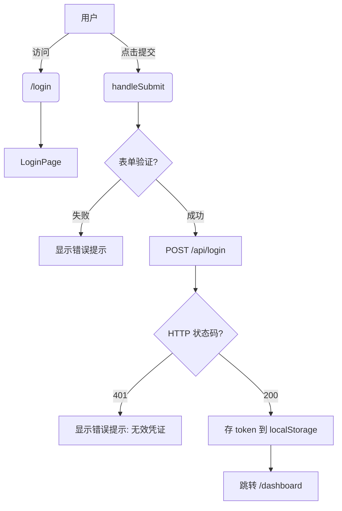

# CodeMap: Frontend Auth Flow

## 1. 核心调用链路 (Core Flow)

## 2. 关键组件 (Key Components)

- **`src/pages/LoginPage`**: 登录页面组件，处理 UI 和表单状态。
- **`src/utils/api`**: 封装的 HTTP 请求库（如 `fetch` 或 `axios`）。
- **`src/utils/auth`**: 包含 `setToken` 和 `getToken` 方法的工具类。

## 3. 数据流与外部依赖 (Data Flow & External Dependencies)

- **外部 API:** `POST /api/login` (来自 `backend-api`)
  - **输入:** `{ "email": "user@example.com", "password": "password123" }`
  - **输出:** `{ "token": "eyJhb...", "expires_in": 3600 }`
- **本地存储:** `localStorage`
  - **Key:** `token`
  - **Value:** JWT 字符串

## 4. 风险点及注意事项 (Risks & Notes)

- **Token 存储风险:** 
  - JWT 目前存储在 localStorage 中，存在 XSS 风险。后续若安全要求提高，可能需要后端配合改为 HttpOnly Cookie。
- **网络异常处理:**
  - `fetch` 请求若遇网络不通（如跨域错误、超时），需要在 catch 块中统一捕获并展示通用错误提示（例如 "网络异常，请稍后再试"）。
