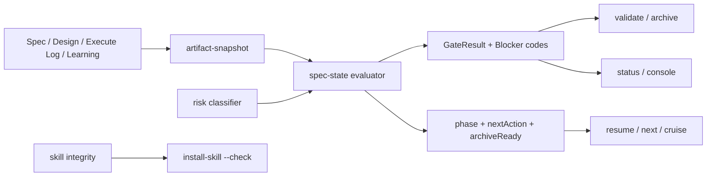

# Technical Design

<!-- Keep headings and labels in English. Fill all design content in Chinese. -->

## Technical Design

Selected Option / ADR:
采用 Option B：统一纯状态评估器 + 薄命令适配层。拒绝继续在各命令内局部维护 gate predicate，也不引入事件溯源或数据库式状态机。权威状态由规范化 artifact snapshot 一次计算；命令只负责读取、展示或执行已经通过门禁的写操作。

Decision Status: 用户已于 2026-07-10 选择 Option B，并批准下述架构边界。

Requirement Traceability:
- Challenge 合法性与证据一致性 → `GateResult.challenge`，覆盖 AC-001。
- Completion Verification 与 AC Coverage 闭环 → `GateResult.completion`，覆盖 AC-002。
- 跨命令统一阶段与 blocker → `WorkflowState` 及消费者适配层，覆盖 AC-003、AC-008。
- `PASS_WITH_CONCERNS` 收敛 → Challenge/Learning 联合状态转换，覆盖 AC-004。
- Cruise、主 Agent、Challenge reviewer 角色边界 → Skill/CLI/generated config 契约，覆盖 AC-005。
- Archive 摘要不再产生占位符 → 归档摘要预构建与预校验，覆盖 AC-006。
- 中文风险否定 → 结构化不可逆性分类，覆盖 AC-007。
- 同版本 Skill 漂移 → 内容指纹与只读检查，覆盖 AC-009。
- 历史制品边界 → active 严格门禁、archive 只读展示，覆盖 AC-010。

Impact Scope:
- 新增：`src/core/artifact-snapshot.js`、`src/core/spec-state.js`、`src/core/risk.js`、`src/core/skill-integrity.js`、`tests/helpers/sdd-fixtures.js`、`tests/state-matrix.test.js`。
- 修改：`lib/common.js`、`src/commands/validate.js`、`resume.js`、`next.js`、`status.js`、`archive.js`、`challenge.js`、`cruise.js`、`install-skill.js`、`_gen-ai-configs.js`、`src/core/workflow.js`、`spec-index.js`、`src/web/console.js`、模板、Skill/指南和现有测试。
- 不修改：CLI 命令名、Spec/Design/Execute Log/Learning 目录模型、reviewer 身份集合、外部 agent 调度方式。

Context / Boundary:
系统边界是本地 Markdown 制品与 SDD CLI。状态评估器只读取传入 snapshot，不访问网络、不调用 agent、不写文件。Artifact reader 负责文件系统读取和规范化；命令写操作仍留在 Challenge、Archive、Install Skill 等命令中，但写入前必须消费统一状态或完整性检查结果。

Domain Model:
- `ArtifactSnapshot`：一次读取得到的 Spec、Design、Execute Log、Learning、项目策略、文件位置和时间信息。
- `GateResult`：某一门禁的 `state`、稳定 `blocker codes`、证据 facts 和建议回退目标。
- `Blocker`：`code`、`gate`、`target`、`message`、`severity`，内部以 code 保持稳定，message 用于 CLI/UI。
- `WorkflowState`：所有 GateResult 聚合后的 `phase`、`nextAction`、`backtrackTarget`、`archiveReady`、`challengeVerdict` 与 `riskFlags`。
- `Consumer Adapter`：validate/resume/next/status/archive/console 对 WorkflowState 的只读渲染或授权写入适配。

Architecture View:


Data Model / Schema:
内部 JS 契约使用普通对象，不新增持久化数据库：
```js
{
  phase: 'research|innovate|design|acceptance|plan|execute|challenge|learning|ready|archived',
  nextAction: 'repair_<target>|run_challenge|archive_ready|new_task',
  backtrackTarget: 'Research|Innovate|Design|Acceptance|Plan|Execute / Debug|Challenge|Learning Check|Ready',
  archiveReady: false,
  challengeVerdict: 'PASS|PASS_WITH_CONCERNS|FAIL_*|',
  gates: {
    research: { state: 'pass|blocked|n/a', blockers: [] },
    design: { state: 'pass|blocked|n/a', blockers: [] },
    acceptance: { state: 'pass|blocked|n/a', blockers: [] },
    plan: { state: 'pass|blocked|n/a', blockers: [] },
    completion: { state: 'pass|blocked|n/a', blockers: [] },
    challenge: { state: 'pass|blocked|failed|n/a', blockers: [] },
    learning: { state: 'pass|blocked|n/a', blockers: [] }
  },
  blockers: [{ code, gate, target, message, severity }],
  riskFlags: []
}
```
稳定 blocker code 至少覆盖：非法/缺失 Challenge、空 Summary、Evidence 不一致、Challenge stale、Completion 字段缺失、AC Coverage 缺失、Research/Design/Acceptance/Plan 缺失、Learning 缺失、Skill drift、Archive summary 不完整。

Data Migration / Backfill:
不批量改写历史归档。`mydocs/archive/` 下的历史 Spec 作为只读记录展示，不重新声明 archive-ready；所有 `mydocs/specs/` active Spec、以及 reopen 产生的新 Spec/Execute Log，执行严格门禁。现有 active 旧日志若缺四轴或 AC Coverage，明确返回迁移 blocker 和补写指引，不以“零条记录”自动放行。

Interface Contract:
- `artifactSnapshot.read(projectDir, specPath, options) -> ArtifactSnapshot`：集中读取引用制品并保证路径仍位于项目根目录。
- `specState.evaluate(snapshot, options) -> WorkflowState`：纯函数；未知或无法解析的安全默认值是 blocked，不得推导 PASS。
- `specState.evaluateProjectSpec(projectDir, specPath, options) -> WorkflowState`：reader + evaluator 的便捷入口。
- `validate.validateSpec()` 保留现有导出签名，内部把 WorkflowState blockers 转为现有 `{ok, issues, specPath}`。
- `workflow.analyzeSpec()` 保留兼容导出，改为包装 WorkflowState，并继续附加 design methodology 提示。
- `skillIntegrity.fingerprint(sourceDir)` 与 `compare(sourceDir, targetDir)` 使用 SHA-256 计算确定性内容指纹。

API Protocol:
现有 CLI 命令及主要标签保持不变。`next`、`resume`、`status` 可增加稳定 blocker code 或 gate 状态，但不得出现 phase/nextAction/archiveReady 相互矛盾。`install-skill --target <target> --check` 为只读模式：一致时退出 0，漂移或缺失时非 0 并输出 source/target version 与 fingerprint；普通 install 成功后输出并保存内容指纹。

State / Concurrency:
评估是单进程同步、无共享可变状态的纯计算。每个命令先构造一次 snapshot，再传给所有 gate；同一命令内不得重复读取同一文件得到不同状态。Console 延续现有 cache，但 cache key 必须包含 Spec 及引用制品签名；写命令完成后清理相关 cache。Challenge freshness 继续以 Execute Log 最新真实 Timestamp 为基准。

Failure Modes:
- Artifact 缺失、路径越界、字段无法解析、未知 verdict → 对应 gate blocked，禁止默认 PASS。
- Challenge Verdict/Summary/Evidence/Backtrack Target 不一致 → Challenge blocked，要求通过 `sdd challenge --record-result` 重写。
- Completion 只有 `Status: DONE` 但缺 Result、AC Coverage Summary、四轴、Verification 或 Timestamp → Completion blocked。
- `PASS_WITH_CONCERNS` 或其他 Learning trigger 存在且 Learning 未完成 → phase=learning；Learning 完成且无其他 blocker → ready。
- Archive summary 无法从现有制品生成完整内容 → 写文件前失败，保留 active artifacts。
- Skill target 无 manifest 或内容不同 → `--check` 报 drift；普通 install 可覆盖为当前 bundle。

Security / Permission:
保持 reviewer 授权规则不变。Challenge reviewer 只读；Cruise 只负责路由；主 Agent 进入目标阶段后按该阶段写入边界修复。所有引用路径继续通过项目根目录约束解析，Skill hash 只读取明确 target，不扫描无关用户目录，不执行目标文件内容。

Observability:
`next` 输出 phase、nextAction、backtrackTarget、riskFlags 和 blockers；`status` 按统一 gate 显示 OK/WARN/BLOCKED；console 展示相同 blocker code 与 archive readiness。`install-skill --check` 输出内容指纹差异。状态矩阵测试记录每个 fixture 在各消费者中的期望结果。

Performance / Capacity:
单个 Spec 的制品体量为小型 Markdown；一次 snapshot 读取后纯计算，复杂度近似 O(制品总行数)。Console 列表复用现有缓存与文件签名，不引入全仓库重复扫描。SHA-256 仅针对 bundled skill 文件集合，开销可忽略。

Compatibility / Rollback:
保留 `validateSpec`、`analyzeSpec` 等外部调用签名和 CLI 命令名，逐个消费者迁移，允许在一个提交内用兼容 wrapper 回滚。历史 archive 不回填；active 制品严格化属于有意行为变化，错误信息必须给出补写指引。若统一 evaluator 引发回归，可回滚消费者适配而不改变 Markdown 数据。Skill `--check` 为新增只读选项，不改变现有安装命令。

Test Strategy:
- 新建 `tests/state-matrix.test.js`，用共享 fixture 同时断言 evaluator、validate、resume、next、status 和 spec-index/console 的一致结果。
- 覆盖 Challenge 空/未知/FAIL/PASS/PASS_WITH_CONCERNS、Summary 空、Evidence 不一致、partial/stale evidence。
- 覆盖 Completion 空壳、四轴缺项、零 AC Coverage、FAIL/SKIPPED/PASS、BLOCKED 后 DONE。
- 覆盖 Research/Design/Acceptance 缺失但 Plan 已签名，确保不能进入 Execute/Archive。
- 覆盖 Learning required 未完成/完成后的状态收敛。
- 在 `tests/commands.test.js` 覆盖归档摘要、Cruise 角色文案、Skill `--check`；在 `tests/workflow.test.js` 覆盖中文否定和真实高风险。
- 每个实现包先运行 targeted red test，再最小实现至 green；最后运行 `node --test tests/*.test.js` 与 `node bin/cli.js doctor D:\workspace\personal\sdd-riper`。

Risks / Trade-offs:
最大风险是迁移期间新旧状态逻辑并存。缓解方式是先建立状态矩阵和兼容 wrapper，再依次迁移写门禁、路由和展示，最终全文扫描并删除重复 predicate。结构化 blocker code 会增加少量内部模型代码，但换取跨消费者确定性。active 严格校验可能暴露旧日志问题，这是预期修复而非回归；必须通过清晰迁移提示降低使用成本。
