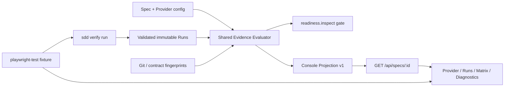

# Technical Design

<!-- Keep headings and labels in English. Fill all design content in Chinese. -->

## Technical Design

Selected Option / ADR:
选择 Option A：共享 Verification Evidence Evaluator + 安全 Console Projection + 真实 Playwright dogfood。中央 evaluator 拥有 freshness 与 AC×project evidence 选择；Console 只消费白名单 read model，不解析 Run 原文。
Requirement Traceability:
AC-001 对应共享 evaluator/projection；AC-002 对应 detail API；AC-003—006 对应前端证据体验；AC-007 对应正式 v3.0 Provider/Chromium gate；AC-008 对应测试依赖与缺浏览器边界。
Impact Scope:
新增 `src/verification/evidence.js` 和 projection 测试；修改 `src/verification/readiness.js`、`src/commands/console.js`、`src/web/{index.html,console.js,console.css}`、`tests/commands.test.js`；扩展 `tests/fixtures/playwright-workspace` 与测试 helper；生成项目级 `.sdd-verification.json` 和 Verification Runs。
Context / Boundary:
Evidence Evaluator 是领域层，只读取已校验 Provider/Run/Spec/Git 事实并输出权威 evidence；Console Projection 是防腐层，裁剪和重新脱敏；Console API/UI 是只读消费者；Playwright fixture 是测试依赖所有者。Console 不执行 Adapter，不拥有 gate 决策。
Domain Model:
`ProviderEvidence` 包含 providerId、配置摘要、readiness、runs、matrix、issues；`CurrentRunEvidence` 包含动态 freshness/reasons、status、gateDecision 和目标；`EvidenceCell` 以 AC×project 为键，指向最新动态 fresh Run 的决策或 missing；`ConsoleVerificationView v1` 是浏览器白名单 Schema。
Architecture View:

Data Model / Schema:
`ConsoleVerificationView`：`{ schemaVersion: 1, state, providers[] }`。Provider 只含 `id/adapter/workspaceRoot/packageRoot/config/projects/toolVersion/readiness/issues/runs/matrix`。Run 只含 `runId/createdAt/status/gateDecision/freshness/freshnessReasons/targets/diagnostics/attachments`。Diagnostic 只含稳定 code 和二次脱敏、最多 1000 字符的 message。Attachment 只含 `name/mediaType/size/sha256/path`，path 必须是受控相对路径。禁止 process、environment、environmentDigests、绝对路径、原始 test ID、原始 JSON、附件内容。
Data Migration / Backfill:
无 Run Schema 迁移；projection 动态读取 v3.0 Run。没有 Runs 时输出稳定空态。未知/非法 Run 形成 blocked issue，不把错误文件返回浏览器。
Interface Contract:
`GET /api/specs/:id` 在既有 detail 上新增 `verification` 字段；列表 API 不加载 Run 详情。无新增写路由。前端继续允许 Validate/Open Artifact，但不存在 verify init/run 动作或按钮。
API Protocol:
响应 `verification.schemaVersion=1`。错误使用既有 JSON error envelope；单个非法 Run 不导致泄露，projection 返回稳定 issue。Console Host/项目/Spec containment 规则保持不变。
State / Concurrency:
Projection 每次 detail 请求动态重算 freshness，不缓存持久化 `run.freshness`。Evaluator 按 createdAt/runId 确定顺序，为每个 AC×project 选择最新 fresh evidence；最新 FAIL/BLOCKED 覆盖历史 PASS。Console 当前项目是进程级状态，因此 E2E 固定单 worker且只选择一个临时项目。

Fixture Lifecycle:
E2E global setup 为每次测试创建唯一临时 Git 项目并写入专用 ownership marker，随后启动带 parent watchdog 的固定端口 Console 服务、将 PID 同时绑定到 state 与 marker，并以 HTTP 200 作为 readiness 条件；global teardown 只有在 temp realpath containment、目录前缀、marker kind/token 和 PID 全部匹配时，才终止并等待服务退出，然后删除项目。下次 bootstrap 对遗留 state 执行相同 fail-closed 校验，先停旧服务再清目录；禁止按时间推断或扫描删除其他临时目录。Playwright webServer 不承担服务所有权，因为 Windows 子进程树回收实测会使测试进程在断言结束后悬挂。Playwright 截图、trace 与 HTML 报告不放入临时 Git 项目，保留在 fixture `test-results` 供诊断；正式 `sdd verify run` 写入真实项目的不可变 Run 永不由 fixture teardown 删除。
Failure Modes:
Provider 缺失→required；已配置无 Run→configured-no-runs；非法/陈旧/覆盖不足→blocked；projection 读取失败→稳定 issue；诊断/附件越界→字段省略并记录 issue；Chromium 缺失→正式 gate BLOCKED，不 SKIP。
Security / Permission:
Projection 只接受 run-store 已校验 Runs，但仍对 Provider、Run、diagnostic code/message、attachment name/mediaType/path 等所有浏览器可见动态字符串重新做字段白名单、credential-pattern 脱敏、长度限制和相对路径 containment；非法 Provider 路径投影为空，附件只允许 `artifacts/` 相对元数据。浏览器永不获得 process/env/绝对路径/原始附件。Console 无执行 Adapter 权限。
Observability:
UI 显示 Provider 状态、最新 Run、freshness reasons、GateDecision、AC×project matrix、诊断 code/message 和附件元数据。状态使用文本+颜色，不只依赖颜色；空态说明下一步由 agent 执行。
Performance / Capacity:
Spec detail 最多返回每 Provider 最近 20 个 Runs；列表 API 不读 Run。矩阵按目标 AC×projects 构建，Run/diagnostic/message 有固定上限。宽矩阵局部横向滚动。
Compatibility / Rollback:
Detail API 只新增字段，旧前端可忽略；UI 无数据时兼容无 E2E Spec。删除 projection/UI/fixture 即可回滚；v3.0 Run 不变。
Test Strategy:
三层验证：Node 单测覆盖 evaluator/projection安全与 freshness；Console API 集成测试覆盖 detail/只读/containment；真实 Chromium E2E 覆盖 Provider/Run/矩阵/诊断/空态/响应式。Fixture bootstrap 先 `npm ci`，再执行 lockfile 固定版本的本地 `playwright install chromium`；Adapter 从 workspace-local `.playwright-browsers` 派生运行环境，不依赖调用者临时环境变量；不隐式安装、不跳过缺失浏览器。
Risks / Trade-offs:
共享 evaluator 重构可能影响 readiness，需状态矩阵回归。E2E bootstrap 增加 CI 时间，但换取干净环境可复现。固定单 worker牺牲速度，避免 Console 全局项目选择互相污染。
