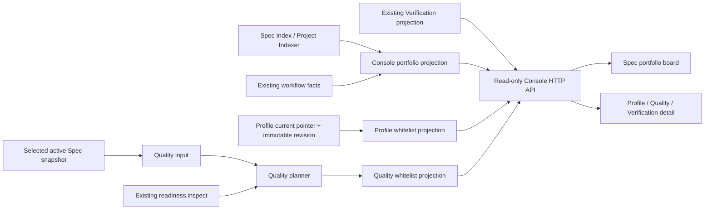

# Technical Design

<!-- Keep headings and labels in English. Fill all design content in Chinese. -->

## Technical Design

Selected Option / ADR:
ADR-CQP-001：采用“Spec 态势板优先 + 选中任务渐进详情”的 Console 重组方案。现有 `spec-index` / `project-indexer` 继续是 Spec 生命周期和工作流事实来源；Console 在 HTTP 边界复制这些事实并派生受限 Work State，而不修改缓存或 workflow。项目级 Profile 摘要从 current pointer 读取，Quality Plan 仅在选中活动 Spec 的详情中由既有纯读取链路计算；归档 Spec 返回固定 not-applicable 状态。

Decision: 桌面工作区由当前“窄 Spec 列表优先服务详情”的比例改为“宽 Spec 态势板为主、详情为次”的两列布局；窄屏按“摘要 → 态势板 → 详情”顺序堆叠。态势板每行同时显示 Task、Lifecycle、Current Phase、Work State、更新时间，顶部始终显示全量总数和阶段分布。Profile、Quality Plan、Verification 只作为选中任务的决策详情，均不可写、不可执行。

Rationale: 用户首先需要知道总共有多少 Spec，以及每个 Spec 正在哪个阶段、处于什么状态。现有 Console 已有完整索引和详情能力，重组与新增白名单投影可直接 dogfood v3.4 / v3.5，且不形成与 AC、workflow 或 Archive 授权竞争的状态机。

Rejected: 按阶段 Kanban 会降低多 Spec 的横向比较和窄屏可用性；仅给现有 38% 宽的列表增加徽标不能改变信息优先级。两者均不采用。

Requirement Traceability: 下表将已确认边界逐项映射到可实现、可测试的设计决策；任何 Plan 步骤都必须保持这些单向依赖和只读约束。

| Confirmed Requirement | Design response |
| :--- | :--- |
| 首屏必须呈现总量、阶段和状态 | `/api/specs` 在现有索引响应的副本上增加 `workState`，前端以宽态势板显示全量总数、阶段计数及每行的 Lifecycle / Phase / Work State；筛选只影响可见行，不重算全量计数。 |
| 不能把未来门禁称为阻塞 | Work State 不读取 `validate.issueCount`；仅显式 Challenge 失败、明确等待 Plan / Archive 授权、等待 Challenge、归档等已有事实形成特定状态，其余均为 In progress。 |
| Profile 与 Quality Plan 均为只读派生物 | 项目 Profile 只经 `store.resolveCurrent()` 形成摘要；活动 Spec 的 Quality 只复用 `loadQualityInput → readiness.inspect → buildQualityPlan`，不调用命令包装层、不中写 Spec 或配置。 |
| Quality Plan 必须绑定精确历史 Profile | Quality projection 只接收选中活动 Spec 的路径和精确 revision 输入；它不使用 current Profile 作为回退。归档 Spec 固定不生成当前 Quality Plan。 |
| AC 是唯一验收真相 | UI 可展示 AC facts、policy focus、mapping、E2E readiness 和诊断，但不输出“已验收”“可归档”“下一步执行”或新的 Gate。 |
| Console 需安全且兼容既有 Verification | 新 Profile / Quality / Work State 都经过服务端白名单与诊断脱敏；`verification` 字段及其缓存隔离保持 v3.1 语义不变。 |

Impact Scope: 影响仅限 Console 的只读投影、HTTP 加法字段、前端布局、受控测试 fixture 与使用文档；不修改 Core workflow、Profile / Quality 领域语义或 Provider / Adapter。

In Scope:

- 在 Console 边界新增纯读取 projection helper，用于 Work State、Profile 摘要和 Quality Plan 摘要。
- 修改 `src/commands/console.js` 的既有读取响应：项目响应增加 Profile view、列表响应增加每项 Work State、详情响应增加 Quality view；不新增写路由。
- 重组 `src/web/index.html`、`src/web/console.js`、`src/web/console.css` 的工作区，使 Spec 态势板成为主列，并为 Profile / Quality / Verification 提供渐进详情。
- 新增 projection / API 集成测试，并扩展受控 Playwright fixture 和 `console-e2e` 场景；更新 GUIDE / README 的 Console 说明。

Out of Scope:

- 修改 Profile detector、candidate、confirm、drift、immutable revision 或 current pointer 的业务规则。
- 修改 Quality Catalog、Planner 规则、AC 格式、Provider / Adapter 契约、Verification Run、workflow 路由、Plan Gate、Cruise 或 Archive 授权。
- 让浏览器调用 CLI、触发 detect/review/confirm、verify init/run、安装 Playwright、执行项目命令或联网。
- 自动确认本项目 Profile。本仓库当前的 missing 状态用于 dogfood 空态；confirmed 路径由受控测试 fixture 覆盖。若未来要确认真实项目 Profile，必须取得单独的人类授权。

Context / Boundary:

Console 是本地只读 HTTP 消费者。它已有 Host 限制、项目选择、Spec containment、索引缓存、Verification projection 和静态前端。新增能力只放在 HTTP / presentation 防腐层：从已解析 Spec 事实生成浏览器 read model，绝不向 Core 反写状态。

项目级 Profile 与任务级 Quality Plan 是不同边界。Profile 摘要读取 `profiles/current.json` 并报告 `confirmed / missing / invalid`，但不做 drift detector 扫描，因此 `confirmed` 仅表示 current pointer 和 immutable revision 可解析，不等同于“最新”。Quality Plan 仅对活动 Spec 读取其 frontmatter 精确绑定的 revision / digest / affected-units；其值即使与 current pointer 不同也必须忠实显示，不允许以 current Profile 补救输入。

Domain Model:

- Lifecycle：Spec 的持久化生命周期 `draft | archived`，直接来自 `spec-index`。
- Current Phase：现有 workflow 路由的当前阶段，例如 `research`、`plan`、`execute`、`archive_authorization`，直接来自 `spec.workflow.phase`。
- Work State：Console 专用、非持久化的操作摘要；只表达用户现在看到的工作情境，不能替代阶段或 Gate。
- Project Profile View：current pointer 的白名单、项目级事实摘要，不是 Profile candidate、drift 结果或确认界面。
- Quality Plan View：选中活动 Spec 的 v3.5 纯读取结果的浏览器安全子集，不是可编辑策略、验收结论或执行计划。
- Verification View：既有 v3.1 Provider / Run / freshness / matrix 投影，保持原有边界和行为。

Architecture View:



`src/commands/console.js` 负责请求 containment、项目选择和 JSON 响应；新增的 Console projection helper 只读文件和已有模块，返回普通对象。Quality command adapter 不被导入，因为它负责格式化及 `process.exitCode`；Console 改为复用其底层输入、readiness 与 planner 链路。前端只渲染版本化 JSON，不含 CLI、Catalog 或 workflow 决策逻辑。

Data Model / Schema:

现有 API 采用加法字段。所有新增浏览器 view 固定 `schemaVersion: 1`，动态字符串均经过长度、相对路径和脱敏处理。

```json
{
  "workState": { "id": "in_progress", "label": "In progress", "tone": "progress" },
  "profile": {
    "schemaVersion": 1,
    "state": "confirmed",
    "revision": "profiles/revisions/sha256-<digest>.json",
    "digest": "sha256:<digest>",
    "unitCount": 2,
    "relationCount": 1,
    "units": [{ "id": "web", "roles": ["frontend"] }],
    "diagnostics": []
  },
  "qualityPlan": {
    "schemaVersion": 1,
    "state": "available",
    "policyVersion": "1",
    "source": {
      "profileRevision": "profiles/revisions/sha256-<digest>.json",
      "profileDigest": "sha256:<digest>",
      "declaredAffectedUnits": ["web"],
      "effectiveAffectedUnits": ["web"]
    },
    "acFacts": [],
    "policyFocus": [],
    "acMappings": [],
    "e2eReadiness": null,
    "diagnostics": []
  }
}
```

`ConsoleWorkState.id` 只允许 `in_progress`、`awaiting_plan_approval`、`awaiting_challenge`、`awaiting_archive_authorization`、`needs_repair`、`archived`。`needs_repair` 必须同时存在合法且失败的显式 Challenge verdict；不得由未写 Challenge 的推断 `FAIL_SPEC` 或 `validate.issueCount` 生成。`awaiting_plan_approval` 仅在 Plan gate 的全部 blocker 都是既有审批字段缺失时生成；否则仍显示 Current Phase 和 `in_progress`。`awaiting_archive_authorization` 由既有 phase / next action 生成，`archived` 由 lifecycle 生成。

Profile view 不含 sourceSnapshot、evidence、manifest、framework evidence、commandRefs、confirmation 或原始错误。Quality view 只含已白名单化的 source 摘要、AC facts、policy focus、AC mapping、readiness 摘要和诊断；不含 `diagnostic.details`、Spec 绝对路径、运行环境或命令。`state` 只允许 `available`、`blocking`、`not_applicable`、`unavailable`；归档 Spec 为 `not_applicable` 且附固定诊断。

Data Migration / Backfill:

无。新增字段从现有内存索引、Profile revision、Spec、Provider / Run 事实按请求动态读取，没有持久化 Console 状态、迁移、回填或 current pointer 写入。

Interface Contract:

- `GET /api/project`：保留既有字段并加法增加 `profile: ConsoleProfileView`。
- `GET /api/specs`：保留既有 snapshot 字段；`specs` 中的每个响应副本加法增加 `workState: ConsoleWorkState`。不在列表响应计算 Quality Plan 或读取 Run。
- `GET /api/specs/:id`：保留既有 detail、`verification` 字段，并加法增加与列表一致的 `workState` 和 `qualityPlan: ConsoleQualityPlanView`。
- 既有 Validate、artifact、open、project 选择路由的 method、参数和错误 envelope 不变；不新增任何 mutate / execute 路由。

浏览器态势板的列顺序固定为 Task、Lifecycle、Current Phase、Work State、Updated。项目摘要显示 Total、Active、Needs repair、Awaiting archive authorization 以及现有阶段计数；`Needs repair` 不是 archive validation issue 的别名。Profile / Quality 默认展示小摘要，详情按需展开，保持 Verification 的 Provider / Run / matrix 区域可达。

API Protocol:

API 仍是仅限 localhost / literal-IP Host 的本地 JSON HTTP 协议，响应使用 `Cache-Control: no-store`。新增 view 自身用 `schemaVersion: 1` 定义演进边界；外层既有 API 不改版本。旧前端忽略未知字段即可继续工作；新前端在 view 不存在或 schema 不支持时显示安全空态，不退回执行 CLI。

State / Concurrency:

所有 projection 为每个请求计算的只读快照。项目索引缓存仍由 `project-indexer` 管理；HTTP 层必须 clone `specs` 后附加 Work State，绝不能修改缓存对象，避免详情投影、前端排序或测试跨请求污染。Profile / Quality / Verification 均不写锁、不重试、不合并；并发外部修改导致不可读时返回稳定 `invalid` / `unavailable` 诊断，下一次刷新重新读取。

Quality projection 不会访问 archive 目录作为当前 Spec，也不会使用 current Profile 回退。它只在已验证为活动 Spec 后读取单次 Spec snapshot，再按 `loadQualityInput → readiness.inspect → buildQualityPlan` 生成；无 e2e 或不完整输入沿用 v3.5 的受限语义，但在浏览器中只显示说明性结果。

Failure Modes:

| Condition | Console behavior |
| :--- | :--- |
| current Profile 不存在 | Profile state 为 `missing`，显示固定 code / 恢复文案；Quality 不以它回退。 |
| current pointer 或 revision 损坏 | Profile state 为 `invalid`，不透传异常；其他 Spec / Verification 仍可浏览。 |
| 活动 Spec 未绑定 exact Profile | Quality state 为 `blocking`，保留安全 AC 摘要及固定恢复文案；不自动 detect / confirm。 |
| Quality 输入或 readiness 无法可靠读取 | Quality state 为 `unavailable` 或 `blocking`，仅返回稳定 code、脱敏 message、恢复动作；不把它标为 AC 或 Archive 失败。 |
| 选中归档 Spec | Quality state 为 `not_applicable`，说明历史任务不生成当前策略投影；Profile 与 Verification 仍遵循各自既有边界。 |
| 审批、Challenge、Archive 情境 | 仅使用已有 workflow facts 派生 Work State；一般未完成阶段为 In progress，绝不由未来 gate 的 issue count 推断 Needs repair。 |
| 新 view 未知或缺失 | 前端显示“数据不可用”安全空态，现有列表、详情、Verification 和 Validate 保持可用。 |

Security / Permission:

所有新增数据均在服务端白名单投影。Profile 只输出 state、revision/digest、数量、unit id / roles；Quality 只输出许可的枚举、unit id、AC id、Provider id、稳定诊断和已脱敏短消息。绝对路径、`..` 路径、credential pattern、environment、source snapshot、evidence、manifest、commandRefs、confirmation、diagnostic details 和原始异常都不得进入 JSON。

活动 Spec 在计算 Quality 前必须同时满足 lexical 与 realpath 的 `<docs-root>/specs` containment；归档或外部路径直接走 not-applicable / not-found，不读取为当前策略输入。现有 Host、项目选择、artifact containment 与 Verification 二次脱敏继续生效。Console 不拥有 Profile 确认、Adapter 执行、包安装、浏览器启动或网络权限。

Observability:

用户可在不查看原始制品的前提下看见总量、阶段计数、Lifecycle、Work State、Profile state、Quality state、policy focus、AC mapping、E2E readiness 和既有 Verification evidence。每个颜色状态同时有文字标签；详情诊断显示稳定 code、短消息和恢复动作。不会新增遥测、日志、Run 或工作流提示。

Performance / Capacity:

列表只复用已缓存的 Spec index 并做 O(spec) 的轻量 Work State 映射，不读 Profile revision、Quality Plan 或 Verification Runs。Profile 在项目加载时读取一次 current pointer / revision；Quality 与 Verification 只在 detail 请求时计算。态势板大于可视高度时在自身区域纵向滚动；宽列和 Verification 矩阵只允许局部横向滚动，`body` 不得产生横向溢出。

Compatibility / Rollback:

这是加法式 Console API 与 UI 重组。既有调用者可忽略 `profile`、`workState`、`qualityPlan`；Verification `schemaVersion`、Provider / Run、Spec index、Profile / Quality CLI、workflow / archive 行为均不改。回滚只需移除新增 projection、API 字段、UI 和测试；因为没有新持久化数据，不需要回填或数据回滚。

Test Strategy:

- `tests/console-projection.test.js`：注入 Profile、Quality、readiness 和不可信诊断夹具，覆盖 Work State 语义、current Profile 的 confirmed / missing / invalid、exact revision 不回退、archive not-applicable、白名单、脱敏、无写入和缓存副本隔离。
- `tests/console-api.test.js`：通过 `createServer` 的受控项目测试三条读取响应、Host / containment、全量计数与筛选独立性、detail 的 Quality / Verification 并存，以及异常稳定 envelope。
- `tests/fixtures/playwright-workspace`：受控临时 Git 项目构造 confirmed Profile revision、绑定活动 Spec、缺失绑定活动 Spec、归档 Spec 与既有 Provider / Run；浏览器检查态势板列、摘要、详情、筛选、窄屏无页面横向溢出和局部滚动。
- 正式验证：先运行聚焦 Node 测试与完整 `npm test`，再经已配置的 `console-e2e` Provider 运行 Chromium。浏览器缺失或 Provider 不可执行应按 v3.0 合同 BLOCKED，不安装、不降级；失败先运行 SDD Debug 再重试。E2E 记录可审计截图 / Run 证据。

Risks / Trade-offs:

方案 A 用更大的态势板换取详情区的首屏空间；用户需要选择任务后再深入 Quality / Verification，但这是已确认的信息优先级。Profile 摘要故意不跑 drift detector，避免把耗时扫描和猜测引入 Console；因此 confirmed 不等同于最新。真实项目当前仍是 Profile missing，只能 dogfood 空态；确认路径由受控 fixture 覆盖，若用户需要真实 current Profile，须走单独授权流程。Quality 视图可能因精确输入或 readiness 不可用而显示 blocking / unavailable，这些永远是说明性诊断，不是新 workflow Gate。
