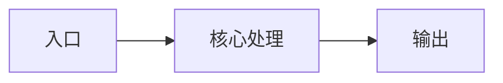

<!--
CodeMap 是模块级活文档：跨任务复用，仅在架构事实变更时更新。
若以下任一维度发生变化，请同步更新 updated-at 与 last-reason。
-->

# main CodeMap

## 入口点（Entry Points）
<!-- 触发方式：HTTP 路由 / CLI 命令 / 事件监听 / 消息队列 / 定时任务 -->

## 模块边界（Module Boundaries）
<!--
- 本模块负责：
- 委托给其他模块：
- 对外暴露的接口：
-->

## 关键组件（Key Components）
<!-- 组件 → 文件路径 → 职责（一行一个） -->

## 核心调用链路（Core Call Chain）
<!--

-->

## 依赖（Dependencies）
<!--
- 内部模块依赖：
- 外部依赖（第三方库 / API / DB / MQ）：
-->

## 风险点（Risks）
<!-- 已知风险、脆弱依赖、需注意的边界条件 -->
