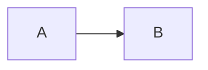

<!--
CodeMap 是模块级活文档：跨任务复用，仅在架构事实变更时更新。
若入口点、核心调用链、外部依赖或风险判断发生变化，请同步更新 updated-at 与 last-reason。
-->

## 入口点（Entry Points）
<!-- 列表：文件路径 / 函数名 -->

## 核心调用链路（Core Call Chain）
<!-- 

-->

## 外部依赖（External Dependencies）
<!-- DB / RPC / MQ 占位符 -->

## 风险点与不确定项（Risks & Unknowns）
<!-- 描述调用链路中的风险或未知节点 -->
